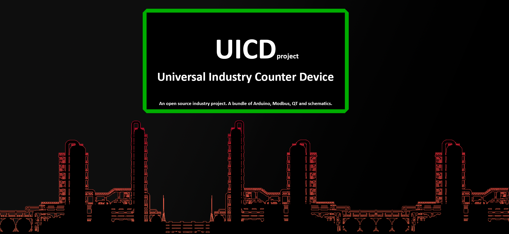

<!-- HEADER PROJECT -->

<h3>#UICD project - for non-commerial activity. </h3>
  

  

   About prject.
     
    <a href="https://github.com/VarionDrakon/UICD/issues">Report Bug</a> · <a href="https://github.com/VarionDrakon/UICD/issues">Request Feature</a>
  

<!-- ABOUT THE PROJECT -->
## About The Project

Here's what:
* 

(<a href="#readme-top">back to top</a>)

### Built With

This section list any major frameworks/libraries used to bootstrap project.

* [![QT][QT]][QT-url]
* [![CPP][CPP]][CPP-url]
* [![QMake][QMake]][QMake-url]

(<a href="#readme-top">back to top</a>)

<!-- LICENSE -->

## License

Distributed under the License. See `LICENSE` for more information.

(<a href="#readme-top">back to top</a>)

<!-- CONTACT -->

## Contact

My name and firstname:
Varion Drakonov (VarionDrakon (Abbreviated)) 

Links to my social networks for communication:

* [![VK][VK]][VK-url]
* [![Facebook][Facebook]][Facebook-url]
* [![Telegram][Telegram]][Telegram-url]
* [![Twitter][Twitter]][Twitter-url]
* [![OK][OK]][OK-url]
* [![Instagramm][Instagramm]][Instagramm-url]
* [![RUTube][RUTube]][RUTube-url]
* [![Microsoft][Microsoft]][Microsoft-url]

(<a href="#readme-top">back to top</a>)

[forks-shield]: https://img.shields.io/github/forks/VarionDrakon/UICD?style=for-the-badge
[forks-url]: https://github.com/VarionDrakon/LauncherGame/network/members

[stars-shield]: https://img.shields.io/github/stars/VarionDrakon/UICD?style=for-the-badge 
[stars-url]: https://github.com/VarionDrakon/LauncherGame/stargazers

[Watch-shield]: https://img.shields.io/github/watchers/VarionDrakon/UICD?style=for-the-badge
[Watch-url]: https://github.com/VarionDrakon/LauncherGame/watchers

[issues-shield]: https://img.shields.io/github/issues-raw/VarionDrakon/UICD?style=for-the-badge
[issues-url]: https://github.com/VarionDrakon/LauncherGame?/issues

[license-shield]: https://img.shields.io/github/license/VarionDrakon/UICD?style=for-the-badge 
[license-url]: https://github.com/VarionDrakon/LauncherGame/blob/main/LICENSE

[CPP]: https://img.shields.io/badge/C%2B%2B-00599C?style=for-the-badge&logo=c%2B%2B&logoColor=white
[CPP-url]: https://devdocs.io/cpp/

[QT]: https://img.shields.io/badge/Qt-41CD52?style=for-the-badge&logo=qt&logoColor=white
[QT-url]: https://doc.qt.io/

[QMake]: https://img.shields.io/badge/Qt-qmake-green.svg?style=for-the-badge&logo=qt&logoColor=white
[QMake-url]: https://doc.qt.io/qt-6/qmake-manual.html

[VK]: https://img.shields.io/badge/VK-4C75A3?style=for-the-badge&logo=vk&logoColor=white
[VK-url]: https://vk.com/varion.drakonov

[RUTube]: https://img.shields.io/badge/RUTube-00001a?style=for-the-badge&logo=PeerTube&logoColor=white
[RUTube-url]: https://rutube.ru/channel/28612463/

[Instagramm]: https://img.shields.io/badge/Instagramm-C13584?style=for-the-badge&logo=Instagram&logoColor=white
[Instagramm-url]: https://www.instagram.com/varion.drakonov

[Telegram]: https://img.shields.io/badge/Telegram-27A7E7?style=for-the-badge&logo=Telegram&logoColor=white
[Telegram-url]: https://t.me/VarionDrakon

[Facebook]: https://img.shields.io/badge/Facebook-3b5998?style=for-the-badge&logo=Facebook&logoColor=white
[Facebook-url]: https://web.facebook.com/varion.drakonov

[OK]: https://img.shields.io/badge/OkRu-ed812b?style=for-the-badge&logo=Odnoklassniki&logoColor=white
[OK-url]: https://ok.ru/varion.drakon

[Twitter]: https://img.shields.io/badge/Twitter-1D9BF0?style=for-the-badge&logo=Twitter&logoColor=white
[Twitter-url]: https://twitter.com/varion_drakonov

[Microsoft]: https://img.shields.io/badge/Microsoft-737373?style=for-the-badge&logo=Microsoft&logoColor=white
[Microsoft-url]: https://learn.microsoft.com/en-us/users/variondrakonov/
