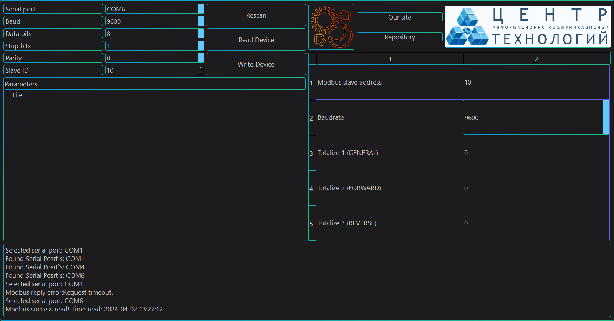

[![Forks][forks-shield]][forks-url]
[![Stargazers][stars-shield]][stars-url]
[![Issues][issues-shield]][issues-url]
[![Watch][Watch-shield]][Watch-url]
[![License][license-shield]][license-url]

<!-- HEADER PROJECT -->

<h3>UICD project - for non-commerial activity. </h3>
  

  

   About prject.
     
    <a href="https://github.com/VarionDrakon/UICD/issues">Report Bug</a> · <a href="https://github.com/VarionDrakon/UICD/issues">Request Feature</a>
  

<!-- TABLE OF CONTENTS -->

  
Table of Contents

  <ol>
    <li>
      <a href="#about-the-project">About The Project</a>
      <ol>
        <li><a href="#built-with">Built With</a></li>
      </ol>
    </li>
    <li><a href="#license">License</a></li>
    <li><a href="#contact">Contact</a></li>
  </ol>

<!-- ABOUT THE PROJECT -->

## About The Project

This is the main project, if you need a project with a configurator and a ModBus implementation in QT, then you need to go here: [UICD.Configurator](https://github.com/VarionDrakon/UICD.Configurator)

Here's what:
* The ability to exchange `Holding Registers` via the ModBus protocol with the configurator.
* Ready-made simple configurator for `UICD` (Recommended for use).
* The source code and circuit board for `EasyEDA` (However, the source code is only for Arduino, the configurator is [here](https://github.com/VarionDrakon/UICD.Configurator))
* Also, if you have poor visibility or like a light/dark theme, you can change it.

(<a href="#readme-top">back to top</a>)

### Built With

This section list any major frameworks/libraries used to bootstrap project.

* [![QT][QT]][QT-url]
* [![CPP][CPP]][CPP-url]
* [![QMake][QMake]][QMake-url]
* [![Arduino][Arduino]][Arduino-url]

(<a href="#readme-top">back to top</a>)

<!-- LICENSE -->

## License

Distributed under the License. See `LICENSE` for more information. Although in short... Then if you use someone else's component under the Apache 2.0 license in the project that contains your NOTICE file, you must copy its contents to the final product. (Of course I don't have a Notice, but the next paragraph is just about that)

Apache 2.0 is permissive, meaning the final product with Apache 2.0 components can have any license. It requires mentioning the original authorship, as well as specifying all the changes made to the work (Although it is not worth reporting, it is not necessary to do DDoS :D).

(<a href="#readme-top">back to top</a>)

<!-- CONTACT -->

## Contact

My name and firstname:
Varion Drakonov (VarionDrakon (Abbreviated)) 

Links to my social networks for communication:

* [![VK][VK]][VK-url]
* [![Facebook][Facebook]][Facebook-url]
* [![Telegram][Telegram]][Telegram-url]
* [![Twitter][Twitter]][Twitter-url]
* [![OK][OK]][OK-url]
* [![Instagramm][Instagramm]][Instagramm-url]
* [![Microsoft][Microsoft]][Microsoft-url]

(<a href="#readme-top">back to top</a>)

[forks-shield]: https://img.shields.io/github/forks/VarionDrakon/UICD?style=for-the-badge
[forks-url]: https://github.com/VarionDrakon/UICD/network/members

[stars-shield]: https://img.shields.io/github/stars/VarionDrakon/UICD?style=for-the-badge 
[stars-url]: https://github.com/VarionDrakon/UICD/stargazers

[Watch-shield]: https://img.shields.io/github/watchers/VarionDrakon/UICD?style=for-the-badge
[Watch-url]: https://github.com/VarionDrakon/UICD/watchers

[issues-shield]: https://img.shields.io/github/issues-raw/VarionDrakon/UICD?style=for-the-badge
[issues-url]: https://github.com/VarionDrakon/UICD?/issues

[license-shield]: https://img.shields.io/github/license/VarionDrakon/UICD?style=for-the-badge 
[license-url]: https://github.com/VarionDrakon/UICD/blob/main/LICENSE

[CPP]: https://img.shields.io/badge/C%2B%2B-00599C?style=for-the-badge&logo=c%2B%2B&logoColor=white
[CPP-url]: https://devdocs.io/cpp/

[Arduino]: https://img.shields.io/badge/Arduino-00979D?style=for-the-badge&logo=Arduino&logoColor=white
[Arduino-url]: https://docs.arduino.cc/

[QT]: https://img.shields.io/badge/Qt-41CD52?style=for-the-badge&logo=qt&logoColor=white
[QT-url]: https://doc.qt.io/

[QMake]: https://img.shields.io/badge/Qt-qmake-green.svg?style=for-the-badge&logo=qt&logoColor=white
[QMake-url]: https://doc.qt.io/qt-6/qmake-manual.html

[VK]: https://img.shields.io/badge/VK-4C75A3?style=for-the-badge&logo=vk&logoColor=white
[VK-url]: https://vk.com/varion.drakonov

[Instagramm]: https://img.shields.io/badge/Instagramm-C13584?style=for-the-badge&logo=Instagram&logoColor=white
[Instagramm-url]: https://www.instagram.com/varion.drakonov

[Telegram]: https://img.shields.io/badge/Telegram-27A7E7?style=for-the-badge&logo=Telegram&logoColor=white
[Telegram-url]: https://t.me/VarionDrakon

[Facebook]: https://img.shields.io/badge/Facebook-3b5998?style=for-the-badge&logo=Facebook&logoColor=white
[Facebook-url]: https://web.facebook.com/varion.drakonov

[OK]: https://img.shields.io/badge/OkRu-ed812b?style=for-the-badge&logo=Odnoklassniki&logoColor=white
[OK-url]: https://ok.ru/varion.drakon

[Twitter]: https://img.shields.io/badge/Twitter-1D9BF0?style=for-the-badge&logo=Twitter&logoColor=white
[Twitter-url]: https://twitter.com/varion_drakonov

[Microsoft]: https://img.shields.io/badge/Microsoft-737373?style=for-the-badge&logo=Microsoft&logoColor=white
[Microsoft-url]: https://learn.microsoft.com/en-us/users/variondrakonov/
